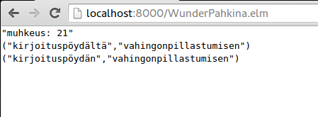

# Muhkeimmat sanaparit

Solution for (http://wunderdog.fi/koodaus-pahkina-kesa-2015), written in Elm.

Screenshot of a successful run:

# Potential for future improvements
- Trim semantic duplicates
- Instead of fixed initial sample size, use smarter predicate for filtering

# License

[BSD (3-clause)](LICENSE)
